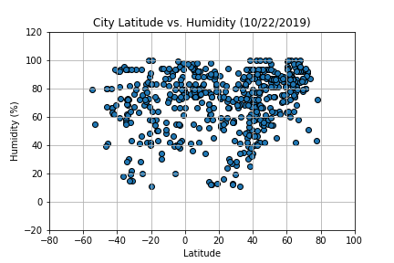
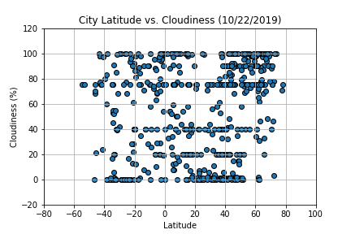
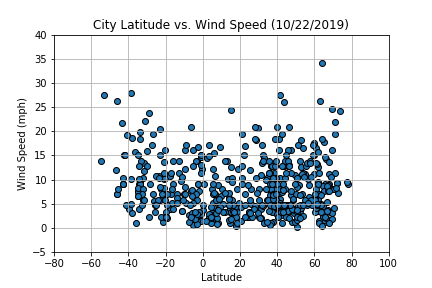

# python-api-challenge
## Python Homework - WeatherPy
* Due on Tuesday: October 22, 2019

### Task: What's the weather like as we approach the equator
* Disclaimer: If you open jupyter notebook from github, markdown analysis part of notebook's numbering appears as all 1 instead of 1,2,3,4 accordingly.

## python-api-challenge folder: 
* NotUsed - WeatherPy_starter.ipynb : referenced as example solution
* README.md
* .gitignore
	## WeatherPy Folder contains:
	* HW06_WeatherPy.ipynby : homework script in here
	+ data/cities.csv
 
    #### image/01_Lat_vs_MaxTemp.png
    
    
    * Cities Latitude vs. Temperature Plot shows that as latitude approaches to equator (x = 0) from north pole (0 < x < 100) and south pole (-80 < x < 0) respectively, there is a definite and firm increase in temperature heading towards the equator. This plot alone depicts possible assumption that temperature is higher for the cities on or near the equator.
    
    
    #### image/02_Lat_vs_Humid.png
    
    
    * Latitude vs. Humidity Plot does not show clear correlation between latitude and humidity towards the equator. However, in this particular set of randomly selected cities, plotted data show that northern latitude positioned cities tend to have more humidity percentages as compared to south of the equator.
    
    
    #### image/03_Lat_vs_Cloud.png
    
    
    * Latitude vs. Cloudiness Plot does not show any relationship to equator, matter in fact, any noticeable trend at all. Cloudiness percentage is evenly spread throughout the latitudes in various percentages. There must some other factor that controls cloudiness in the cities rather than latitude position.
    
    
    #### image/04_Lat_vs_Wind.png
    
    
    * Latitude vs. Wind Speed Plot does not seem to show relationship towards the equator. However, it is still observable that regarless of the latitude position, wind speed is very low in most cities and the number of cities falls as wind speed increases. It is possible to assume there is some other factor that relates to wind speed in the cities.
    
## Purpose: Use api, pandas library and Matplotlib library to organize and create summary data frame and various graphs.