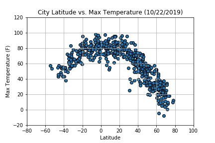

# python-api-challenge
## Python Homework - WeatherPy
* Due on Tuesday: October 22, 2019

### Task: What's the weather like as we approach the equator

## python-api-challenge folder: 
* NotUsed - WeatherPy_starter.ipynb : referenced as example solution
* README.md
* .gitignore
	## WeatherPy Folder contains:
	* HW06_WeatherPy.ipynby : homework script in here
	+ data/cities.csv
 
    + image/01_Lat_vs_MaxTemp.png
    
    
    
    + image/02_Lat_vs_Humid.png
    
    
    
    + image/03_Lat_vs_Cloud.png
    
    
    
    + image/04_Lat_vs_Wind.png
    
    
    
## Purpose: Use api, pandas library and Matplotlib library to organize and create summary data frame and various graphs.